# 益禾堂点餐系统 (Yongge Tea Order)

一款基于 **Uni-app x (UTS)** 和 **Vue 3** 开发的现代化移动端点餐应用。该项目旨在为用户提供流畅、直观的奶茶点购体验，支持多平台（App、小程序、H5）部署。

## 📱 产品概览

本项目深度还原了“益禾堂”品牌的线上点餐流程，涵盖了从门店选择到订单完成的全链路功能。

### 核心功能描述

- **首页 (Home)**：品牌活动展示、快捷功能入口（到店自取、外卖送餐）。
- **门店列表 (Store List)**：基于地理位置展示周边门店，支持切换不同区域的门店。
- **点单页 (Menu)**：清晰的商品分类导航，支持左右联动滚动。
- **商品详情 (Product Detail)**：支持选择规格、甜度、冰度等定制化选项。
- **购物车 (Cart)**：灵活的商品数量调整、侧滑管理。
- **结算与支付 (Checkout)**：集成地址选择（自取/外卖）、备注填写及支付流程。
- **订单中心 (Order)**：实时追踪订单状态（待支付、制作中、配送中、已完成/取消），查看详细订单信息。
- **地址管理 (Address)**：便捷的新增、编辑和删除收货地址。
- **个人中心 (Profile)**：展示用户信息、优惠券、积分及历史订单入口。

### UI 设计图展示 (业务流程)

以下按照用户点餐的典型路径展示产品界面：

1. **首页**
   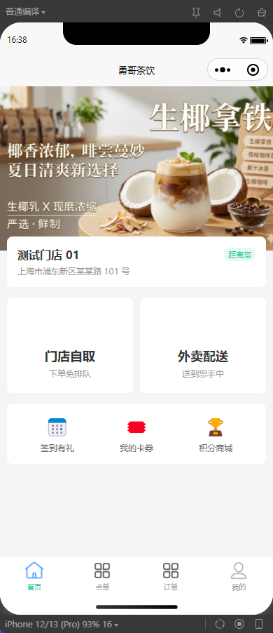

2. **门店选择**
   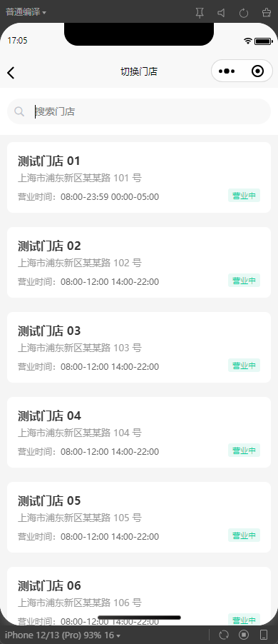

3. **点单主页**
   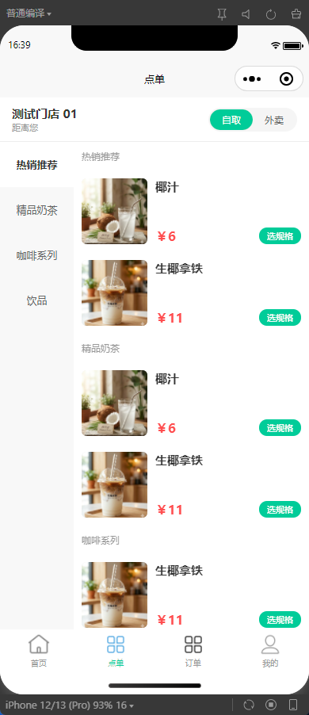

4. **商品详情**
   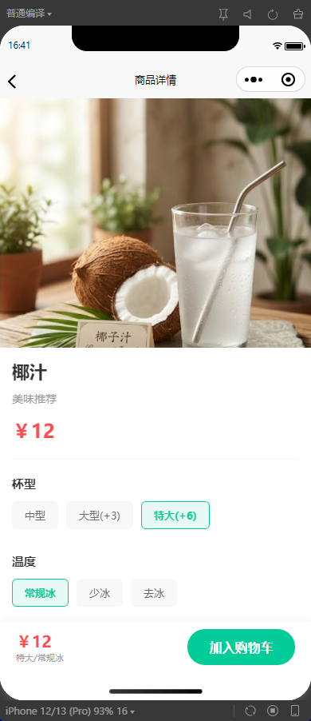

5. **购物车与管理**
   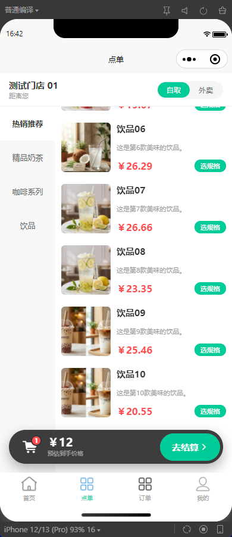
   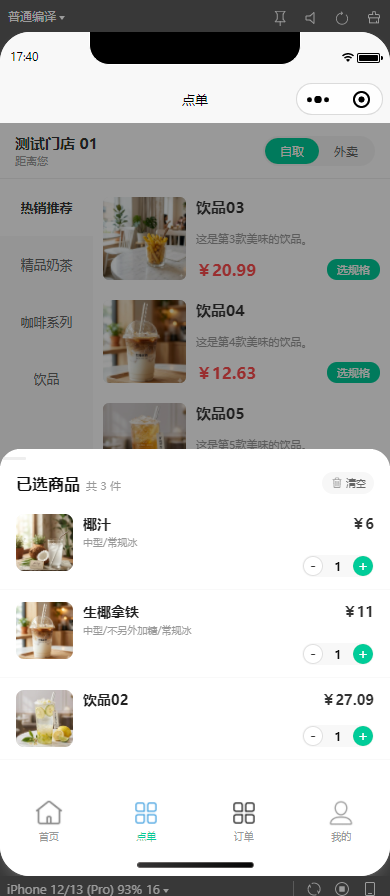

6. **地址管理**
   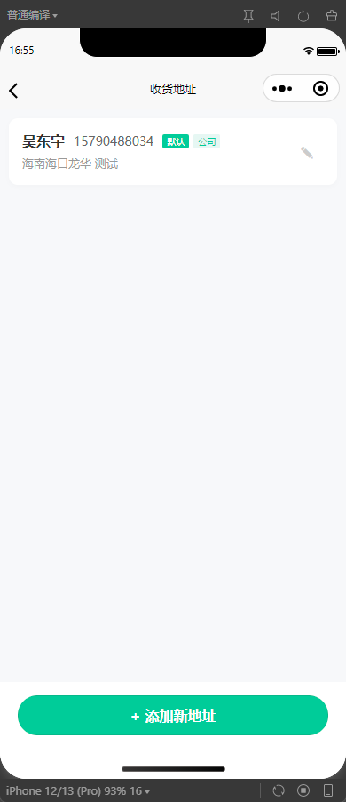
   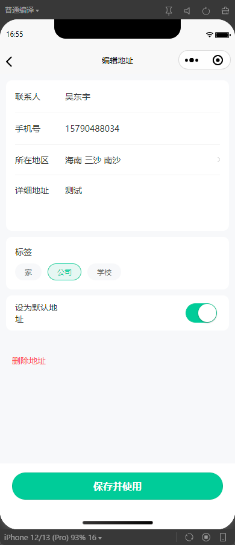

7. **订单追踪**
   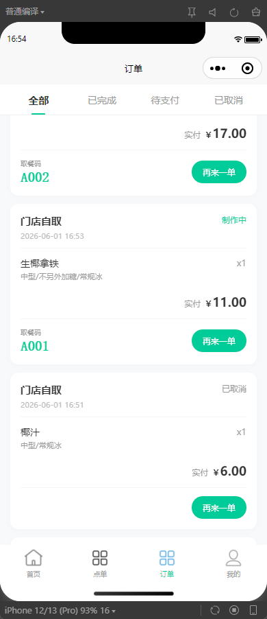
   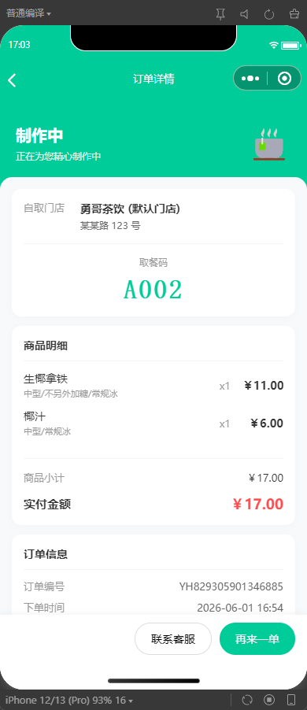
   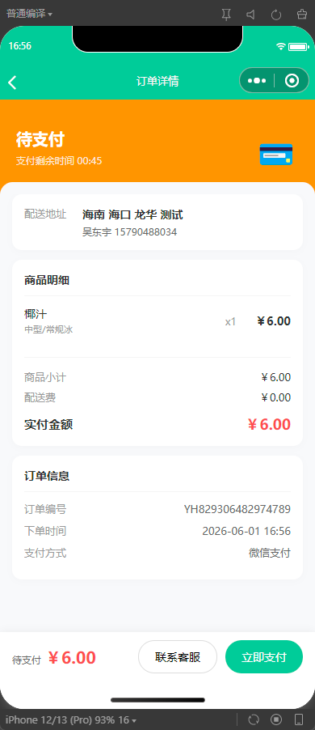

8. **个人中心**
   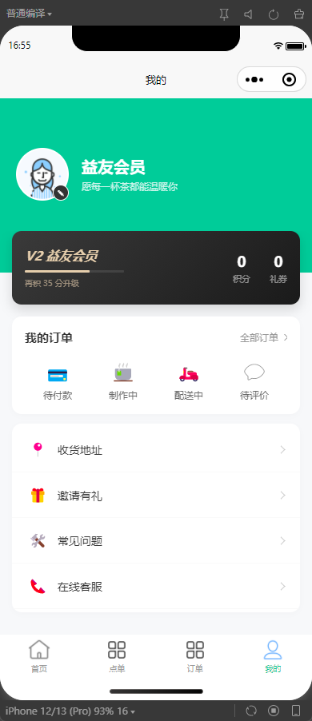

---

## 🛠 开发文档

### 技术栈

- **框架**: [Uni-app x](https://uniapp.dcloud.net.cn/uni-app-x/) (UTS)
- **视图层**: Vue 3 (Composition API)
- **状态管理**: Pinia
- **UI 组件库**: uni-ui
- **样式**: SCSS / CSS
- **脚本语言**: UTS (Uni-app TypeScript)

### 项目结构

```text
E:\Code\yongge-tea-order\
├───pages/              # 业务页面
│   ├───index/          # 首页
│   ├───menu/           # 点单与商品详情
│   ├───store/          # 门店选择
│   ├───checkout/       # 结算页
│   ├───order/          # 订单列表与详情
│   └───profile/        # 个人中心与地址管理
├───store/              # Pinia 状态管理 (app, cart, user, address)
├───utils/              # 工具类 (request, payment, format)
├───static/             # 静态资源 (Banner, 图标, 初始数据)
├───uni_modules/        # uni-app 插件与组件库
└───main.uts            # 项目入口文件
```

### 环境要求

1. **HBuilderX**: 推荐使用最新版本的 HBuilderX 以获得最佳的 UTS 开发体验。
2. **Node.js**: 建议使用 LTS 版本。

### 快速开始

1. **克隆项目**
   
   ```bash
   git clone <repository-url>
   cd yongge-tea-order
   ```

2. **安装依赖**
   
   ```bash
   npm install
   ```

3. **运行项目**
   
   - 在 HBuilderX 中打开本项目。
   - 点击上方菜单栏的“运行”。
   - 选择“运行到内置浏览器”或“运行到手机或模拟器”。

### 开发规范

- **状态管理**: 所有全局状态（购物车、用户信息、收货地址）必须通过 `store/` 目录下的 Pinia store 管理。
- **API 请求**: 统一使用 `utils/request.uts` 进行 network 请求，确保 Token 自动注入和错误拦截。
- **强类型 (UTS)**: 充分利用 UTS 的静态检查特性，为 API 返回数据和复杂组件 Props 定义 `interface` 或 `type`。
- **样式规范**: 优先使用 `uni.scss` 中定义的全局变量（如主色调 `$uni-primary`），确保 UI 一致性。

---

## 📄 许可证

[MIT License](LICENSE)
